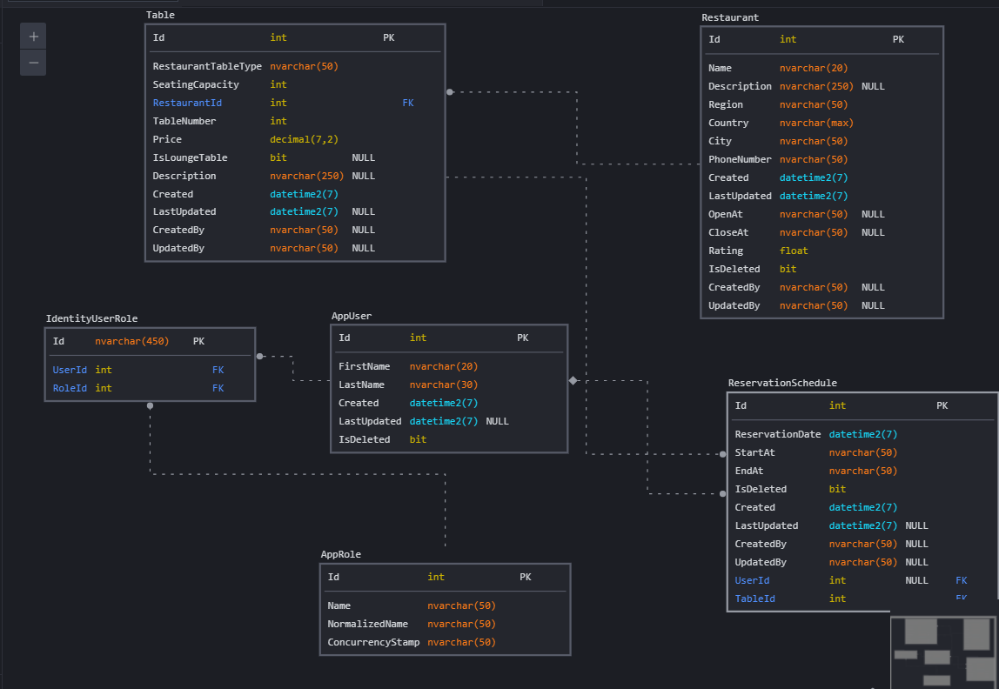

# Restaurant Reservation
## Author: Mohammad Alfayoume
## Technologies: Asp.Net Core
## Design Patterns: Dependency Injection Pattern, Repository Pattern
---
> ### Requirements
Create a backend API for the restaurant reservations application with the following functionalities: 

1. Support 2 user types: - Admin: full authority on the system - Users: uses the reservation functionality.

2. Add/Update/Delete restaurants. (Restaurants should have the basic details, I will leave it to you to decide the fields).

3. Add tables for each restaurant. (Tables will have certain properties that affect the reservation as well as the price. Number of seats, Indoor/Outdoor, lounge tables).

4. Restaurants will have a specific schedule for reservations. 

5. Users can add/update their reservations. 

6. Reservations can be cancelled before 2 hours of the reservation time. 

7. Restaurants should be searchable.

> ### Entity Relations
* One Restaurant has Many Tables.
 
* One Table has Many Reservations.
 
* One User has Many Reservations.
 
* Many Users has Many Roles.

> ### Database Design

---
> ### APIs
* URL: `https://localhost:7196/`

* Endpoints:
1. Account

    * Registration `POST`:  `api/accounts/register`
    * Login `POST`: `api/accounts/login`
    * Logout `POST`: `api/accounts/logout`
2. User

    * Get All `GET`: `api/users`
    * Get One `GET`: `api/users/:id`
    * Update `PUT`: `api/users/:id`
    * Delete `DELETE`: `api/users/:id`
    * Add User Reservation `POST`: `api/users/:userId/reservations/:reservationId`
    * Modify User Reservation `PUT`: `api/users/:userId/reservations/:reservationId`
    * Cancel `POST`: `api/users/:userId/reservations/:reservationId/cancel`
3. Restaurant

    * Get All `GET`: `api/restaurants`
    * Get One `GET`: `api/restaurants/:id`
    * Create `POST`: `api/restaurants`
    * Update `PUT`: `api/restaurants/:id`
    * Delete `DELETE`: `api/restaurants/:id`
    * Search `GET`: `api/restaurants/search`
4. RestaurantTable

    * Get All `GET`: `api/restaurantTables`
    * Get One `GET`: `api/restaurantTables/:id`
    * Create `POST`: `api/restaurantTables`
    * Update `PUT`: `api/restaurantTables/:id`
    * Delete `DELETE`: `api/restaurantTables/:id`
5. RestaurantTableType

    * Get All `GET`: `api/restaurantTableTypes`
    * Get One `GET`: `api/restaurantTableTypes/:id`
    * Create `POST`: `api/restaurantTableTypes`
    * Update `PUT`: `api/restaurantTableTypes/:id`
    * Delete `DELETE`: `api/restaurantTableTypes/:id`
6. Reservation

    * Get All `GET`: `api/reservations`
    * Get One `GET`: `api/reservations/:id`
    * Create `POST`: `api/reservations`
    * Update `PUT`: `api/reservations/:id`
    * Delete `DELETE`: `api/reservations/:id`
7. Add TableType to Table
    * `POST`: `api/restaurantTableTypes/{typeId}/Table/{tableId}`
8. Add Table to Restaurant
    * `POST`: `api/restaurants/{restaurantId}/tables/{tableId}`
9. Add Reservation to Table
    * `POST`: `api/restaurantTables/{tableId}/reservations/{reservationId}`
10. Add Reservation To User
    * `POST`: `api/users/{userId}/reservations/{reservationId}`
11. Get all Tables for Restaurant
    * `GET`: `api/restaurants/{id}/tables`
12. Get all Reservations for Table
    * `GET`: `api/restaurantTables/{id}/reservations`
13. Get All Reservations for User
    * `GET`: `api/users/{id}/reservations`

>### Resources
* Udemy Course: `Build an app with ASPNET Core and Angular from scratch`
* ASP.Net (Minimal API) Crash Course: `https://www.youtube.com/watch?v=bKCzoR01lpE&ab_channel=JulioCasal`
* ASP.Net (Controller) Crash Course: `https://www.youtube.com/watch?v=Fbf_ua2t6v4&ab_channel=PatrickGod`